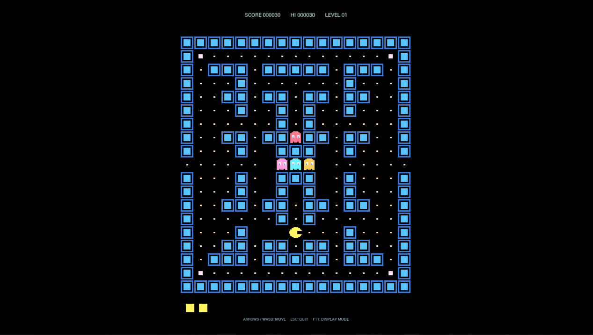

# Neon Maze Chaser

Unreal Engine 5.5とC++で制作した、オリジナルのレトロ迷路ゲームです。

作者：たむたむ

迷路内のドットを集めながら4体の敵を避け、すべてのドットを取るとステージクリアです。四隅のパワードットを取ると、一定時間だけ敵を倒せます。

## 特徴

- タイトル画面とSTARTボタン
- カーソルキーまたはWASDによる移動
- 性格の異なる4体の追跡キャラクター
- 通常ドットとパワードット
- スコア、ハイスコア、残機、レベル表示
- ゲーム中に生成するレトロ効果音
- 可変ウィンドウと全画面表示
- 外部の画像・音声素材を使用しないHUD描画

## 操作方法

| キー | 操作 |
| --- | --- |
| STARTボタン、`Enter`または`Space` | ゲーム開始 |
| カーソルキーまたは`W` `A` `S` `D` | 移動 |
| `F11` | ウィンドウ表示と全画面表示の切り替え |
| `Esc` | ゲーム終了 |

## Windows版

Windows版は次のフォルダーにあります。

`../NeonMazeChaser_Windows_v0.2.0/Windows/NeonMazeChaser.exe`

配布時は`exe`だけを取り出さず、`Windows`フォルダー内の構成を維持してください。

## 必要環境

- Unreal Engine 5.5
- C++ワークロードを導入したVisual Studio 2022 Build Tools
- Windows 10またはWindows 11

## 権利関係

迷路追跡型ゲームのジャンルを参考にしたオリジナル作品です。既存ゲームの画像、音声、迷路、コードは含まれていません。
